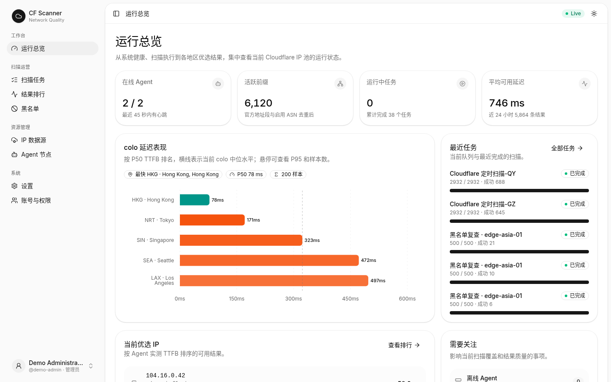
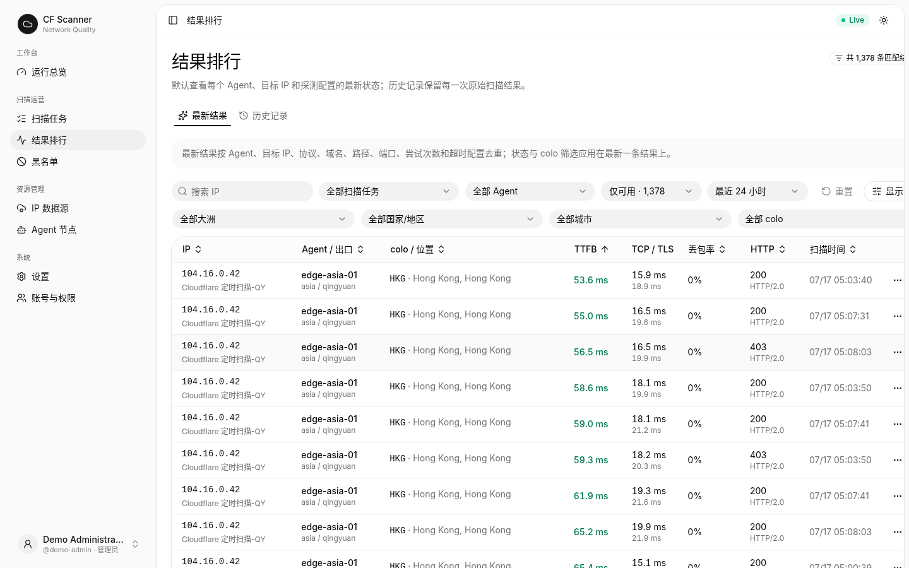
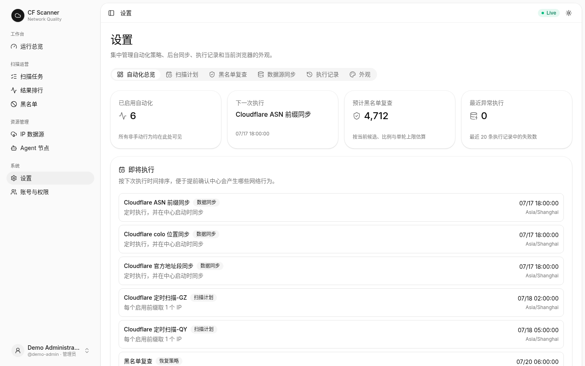

# CF Scanner

[](https://github.com/3011/cfscan/actions/workflows/ci.yml)
[](https://github.com/3011/cfscan/actions/workflows/codeql.yml)
[](LICENSE)
[](https://github.com/3011/cfscan/releases)

A distributed Cloudflare Anycast IP scanning, ranking, automation, and monitoring platform.

[中文文档](README.zh-CN.md) · [Documentation](docs/README.md) · [Security](SECURITY.md) · [Contributing](CONTRIBUTING.md)

> CF Scanner is an independent open-source project. It is not affiliated with, endorsed by, or sponsored by Cloudflare, Inc. Cloudflare is a trademark of Cloudflare, Inc.



## What it does

CF Scanner coordinates lightweight regional Agents from a central Go service. Agents probe selected Cloudflare addresses while preserving HTTP Host and TLS SNI, then return TCP, TLS, TTFB, availability, CF-RAY, and colo measurements. The Center stores and ranks results per Agent, runs schedules, and manages temporary blacklist rechecks.

- distributed outbound-only Agents;
- Cloudflare official and ASN prefix sources;
- latest-result ranking and complete history;
- server-side filters, sorting, pagination, and geographic facets;
- configurable scan schedules and source synchronization;
- Agent-scoped temporary blacklist and rechecks;
- administrator/viewer RBAC with secure server sessions;
- responsive React 19 console using shadcn/ui Rhea, Base UI, and Tailwind CSS 4.

| Results | Automation |
|---|---|
|  |  |

## Quick start

Requirements: Docker with Compose support.

```bash
cp .env.example .env
docker compose --profile agent up -d --build
```

Open `http://localhost:18081` and sign in with the bootstrap administrator configured in `.env`.

The example credentials are for local development only. Replace the Agent token and administrator password before any shared or Internet-accessible deployment.

## Architecture

```text
React management console
          │
       Go Center ─── PostgreSQL
          │ HTTPS JSON; Agents initiate every connection
   ┌──────┼────────┐
 Asia Agent   Europe Agent   North America Agent
```

See [`docs/architecture.md`](docs/architecture.md) for task leases, result semantics, automation, authentication boundaries, and database behavior.

## Container images

Release tags publish multi-architecture images:

```text
ghcr.io/3011/cfscan-server
ghcr.io/3011/cfscan-agent
ghcr.io/3011/cfscan-web
```

Use immutable release tags in production. See [`docs/operations.md`](docs/operations.md) for configuration, health checks, backup, release, and rollback guidance.

## Development

```bash
make check
```

This validates documentation, Go tests and builds, UI architecture boundaries, linting, TypeScript, Vitest, and the production web build. See [`docs/development.md`](docs/development.md) for split-process development and browser regression testing.

## Security and responsible use

CF Scanner performs active network measurements. Only scan systems and address ranges you own or are explicitly authorized to test. Read [`RESPONSIBLE_USE.md`](RESPONSIBLE_USE.md) before deployment.

Report vulnerabilities privately according to [`SECURITY.md`](SECURITY.md). Never include credentials or production data in public issues.

## Project status

The first public release is suitable for self-hosted use, but operators should review retention, backup, rate limits, and network policy for their environment. The current maintenance backlog is documented in [`docs/maintenance-audit.md`](docs/maintenance-audit.md).

## License

Apache License 2.0. See [`LICENSE`](LICENSE) and [`NOTICE`](NOTICE).
